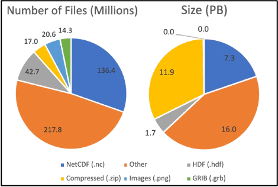

========================
CFA and Distributed Data
========================

Data Archives
-------------

The need for cloud-accessible analysis-ready data is increasing due to high demand for cloud-native applications and wider usability of data.
Current archival formats and access methods are insufficient for an increasing number of user needs, especially given the volume of data being
produced by various projects globally. 

The CEDA-operated JASMIN data analysis facility has a current (2024) data archive of more than 30 Petabytes, with more datasets being ingested 
daily. Around 25% of all datasets are in NetCDF/HDF formats which are well-optimised for HPC architecture, but do not typically perform as well 
and are not as accessible for cloud-based applications. The standard NetCDF/HDF python readers for example require direct access to the source
files, so are not able to open files stored either in Object Storage (S3) or served via a download service, without first downloading the whole file.

Distributed Data
----------------

The aim of CFA and aggregating distributed data in general, is to make the access of data more effective when dealing with these vast libraries of data.
Directly accessing the platforms, like JASMIN, where the data is stored is not necessarily possible for all users, and we would like to avoid the dependence
on download services where GB/TBs of data is copied across multiple sites. Instead, the data may be accessed via a **reference/aggregation file** which provides
the instructions to fetch portions of the data, and applications reading the file are able to load data as needed rather than all at once (Lazy Loading).

.. image:: _images/DataDistributed.png
   :alt: A diagram of how the typcial Distributed Data methods operate.
   :align: center

Formats which provide effective remote data access are typically referred to as **Cloud Optimised Formats** (COFs) of which CFA is just one example. Other
examples include `Zarr <https://zarr.readthedocs.io/en/stable/>`_ and `Kerchunk <https://fsspec.github.io/kerchunk/>`_, as in the diagram above. Zarr 
stores contain individual **binary-encoded** files for each chunk of data in memory. Opening a Zarr store means accessing the top-level metadata which 
informs the application reader how the data is structured. Subsequent calls to load the data will then only load the appropriate memory chunks. Kerchunk
functions similarly as a pointer to chunks of data in another location, however Kerchunk only references the existing chunk structure within NetCDF files,
rather than having each chunk as a separate file. 

CFA takes elements of both of these methods; it acts as a reference to existing Archive data like Kerchunk and can function with data stored in Object Storage
like Zarr, but the key difference is that the `chunks` in CFA are just portions of the array, rather than ranges of bytes of compressed/uncompressed data.

CF aggregations
---------------

CFA parameters are now included in the CF conventions (as of CF version 1.12 - November 2024), and define how so-called 'aggregation variables' should be defined within a CFA-netCDF file.
A CFA-netCDF file acts as a reference file to a set of Fragment files (which may be netCDF or other formats), and an appropriate application reader (like
CFAPyX) is able to read and interpret the aggregated data into the proper set of variables and dimensions that cover the extent of the set of Fragment files.
Accessing a subset of the data is then made more efficient as the application reader can fetch only the portions of the array required by the user for any
particular computation.